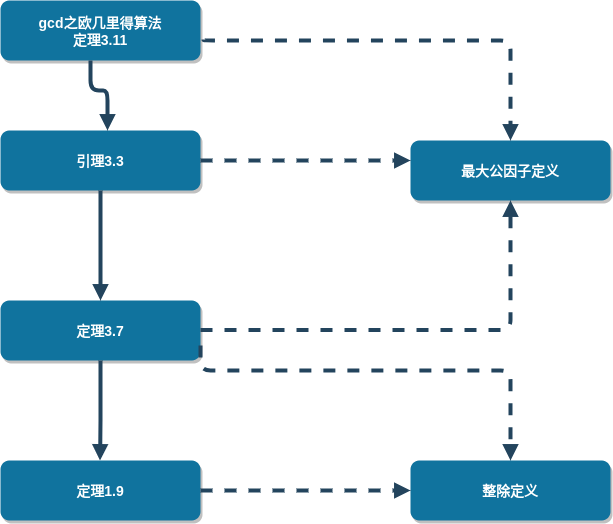

## 初等数论及其应用（原书第6版）

### 1.5 整除性

#### 整除

**定义** 如果$a$和$b$为整数且$a \neq 0$，我们说$a$**整除**$b$是指存在整数$c$使得$b = a c$。如果$a$整除$b$，我们还称$a$**是**$b$**的一个因子**，且称$b$**是**$a$**的倍数**。

如果$a$整除$b$，则将其记为$a \mid b$，如果$a$不能整除$b$，则记其为$a \nmid b$。

#### 定理1.9 如果$a$，$b$，$m$和$n$为整数，且$c \mid a$，$c \mid b$，则$c \mid (m a + n b)$。

**证明** 因为$c \mid a$且$c \mid b$，故存在整数$e$和$f$，使得$a = c e$，$b = c f$。因此$m a + n b = m c e + n c f = c (m e + n f)$。从而，$c \mid (m a + n b)$。

#### 最大公因子

**定义** 不全为零的整数$a$和$b$的最大公因子是指能够同时整除$a$和$b$的最大整数。

$a$和$b$的最大公因子记作$(a, b)$。有时也记作$gcd(a,b)$。

注意当$n$为正整数时，$(0, n) = (n, 0) = n$。

虽然所有的正整数都能够整除$0$，我们还是定义$(0, 0) = 0$。这样可以确保关于最大公因子的相关结论在所有情况下均成立。

### 3.3 最大公因子及其性质

#### 定理3.7 令$a$，$b$，$c$是整数，那么$(a+c b, b) = (a, b)$。

**证明** 令$a$，$b$，$c$是整数。我们将证明$a$，$b$的公因子与$a+c b$，$b$的公因子相同，即证明$(a+c b, b) = (a, b)$。令$e$是$a$，$b$的公因子。由定理1.9可知$e  \mid  (a+c b)$，所以$e$是$a+c b$和$b$的公因子。如果$f$是$a+c b$和$b$的公因子，那么由定理1.9可知$f$整除$(a+c b)-c b = a$，所以$f$是$a$，$b$的公因子。因此$(a+c b, b) = (a, b)$。

### 3.4 欧几里得算法（Euclidean algorithm）

#### 定理3.11（欧几里得算法）令整数$r_0 = a$，$r_1 = b$满足$a \ge b > 0$，如果连续做带余除法得到$r_j = r_{j+1} q_{j+1} + r_{j+2}$，且$0 < r_{j+2}  < r_{j+1}$（$j = 0, 1, 2, \cdots, n-2$），$r_{n+1} = 0$，那么$(a, b) = r_n$，它是最后一个非零余数。

从定理中我们看到通过连续应用带余除法，在每一步中被除数和除数被更小的数代替（这些更小的数实际上是每一步中的除数和余数），运算直到余数为零时终止。这一系列运算产生了一系列的等式，而最大公因子就是最后一个非零的余数。

为了证明欧几里得算法得到最大公因子的正确性，我们给出如下引理。

#### 引理3.3 如果$e$和$d$是整数且$e = d q + r$，其中$q$，$r$是整数，那么$(e, d) = (d, r)$。

**证明** 在定理3.7中，取$a = r$，$b = d$，$c = q$，（即$(r+ q d, d) = (r, d)$），那么由定理3.7可以直接得到引理。

我们现在证明欧几里得算法得到的是两个整数的最大公因子。

**证明** 令$r_0 = a$，$r_1 = b$是正整数且满足$a \ge b$，那么通过连续运用带余除法，我们求得

$$
\begin{matrix}
r_0 = r_1 q_1 + r_2 & 0 \le r_2 < r_1 \\
r_1 = r_2 q_2 + r_3 & 0 \le r_3 < r2 \\
\vdots & \\
r_{j-2} = r_{j-1} q_{j-1} + r_j & 0 \le r_j < r_{j-1} \\
\vdots & \\
r_{n-4} = r_{n-3} q_{n-3} + r_{n-2} & 0 \le r_{n-2} < r_{n-3} \\
r_{n-3} = r_{n-2} q_{n-2} + r_{n-1} & 0 \le r_{n-1} < r_{n-2} \\
r_{n-2} = r_{n-1} q_{n-1} + r_n & 0 \le r_n < r_{n-1} \\
r_{n-1} = r_n q_n
\end{matrix}
$$

可以假设最终一定会有一个余数为零，这是因为余数组成的序列$a = r_0 \ge r_1 > r_2 > \cdots \ge 0$所包含的项的个数不会大于$a$（因为每个余数都是整数）。由引理3.3，我们得到$(a, b) = (r_0, r_1) = (r_1, r_2) = (r_2, r_3) = \cdots = (r_{n-3}, r_{n-2}) = (r_{n-2}, r_{n-1}) = (r_{n-1}, r_n) = (r_n, 0) = r_n$。因此$(a, b) = r_n$，这是最后一个非零余数。

我们举下面的例子来说明欧几里得算法的用途。

**例3.12** 用欧几里得算法求$(252, 198)$的步骤如下：
$$
252 = 198 \cdot 1 + 54 \\
198 = 54 \cdot 3 +36 \\
54 = 36 \cdot 1 + 18 \\
36 = 18 \cdot 2
$$
我们将这些步骤总结在下表中：

| $j$  | $r_j$ | $r_{j+1}$ | $q_{j+1}$ | $r_{j+2}$ |
| ---- | ----- | --------- | --------- | --------- |
| 0    | 252   | 198       | 1         | 54        |
| 1    | 198   | 54        | 3         | 36        |
| 2    | 54    | 36        | 1         | 18        |
| 3    | 36    | 18        | 2         | 0         |

最后一个非零除数（在最后一列倒数第二行的那个数）就是252和198的最大公因子。因此$(252, 198) = 18$

附录：
定理证明路线图

